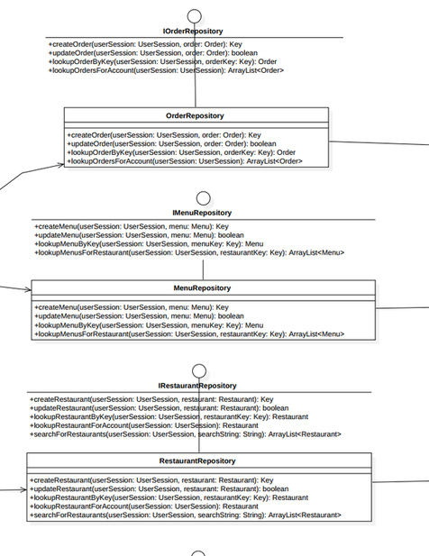
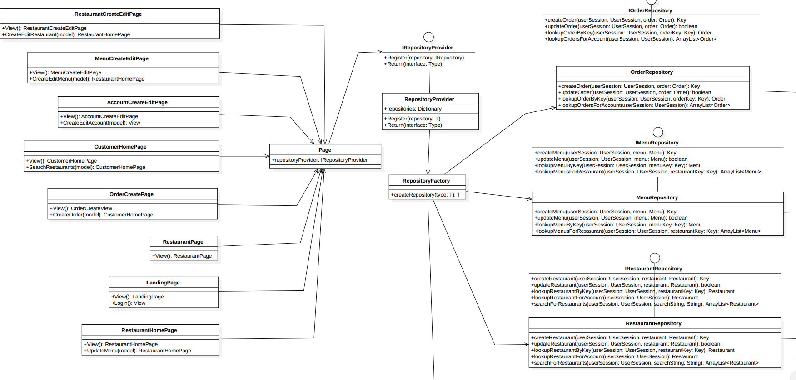

# Final Report

## Team
*  Seth Perry
*  Sudeep Galgali
*  Christina Nguyen

## Title
The Third Meal

## Features Implemented

| ID | Requirement | Topic Area | Actor | Priority |
| --- | --- | --- | --- | --- |
| BR002 | Verify if a customer is genuine | Authentication | Customer | Medium |
| BR006 | Track time to fulfillment | Orders | Restaurant owner / System | Low |
| UR003 | Users should be able to add and edit menus for their restaurant | Store | Restaurant owner | High |
| UR004 | Users should be able to cancel an active order | ORders |Customer / Restaurant owner | Medium |
| UR006 | Users should be able to create and edit their profiles | Profile | Customer / Restaurant owner | High |
| UR008 | Users should be able to update order status | OrdersUR | Restaurant owner | High |
| NF003 | Accounts should be password-protected | Security | High |
| NF004 | Data access should be well-segregated, allowing for database changes | Maintainabiliity | Medium |
| NF005 | All transactions should be ACID compatible | Reliability | High |

## Features Not Implemented

| ID | Requirement | Topic Area | Actor | Priority |
| --- | --- | --- | --- | --- |

## Class Diagrams

For the diagrams, please refer to Appendix A.

There a few major differences between our class diagrams for part 2 and part 3. Because of the sheer size and ordering of the original class diagram, it is very hard to comprehend the relation between the objects. In the final class diagrams we have arranged it based on the functionality. This made our class diagram more understandable and clean. 

In the final class diagram we have also made use of multiple design patterns, most importantly Dependency Injection and Strategy design patterns(discussed in more detail below). It reduced the coupling between our classes which meant less lines in the class diagram, reduced the complexity of the project and increased the ease of development. 

Since most of the design of the project was performed before the actual development, there were very less decisions to make as we were writing the code. Class diagram helped in understanding all the different moving parts of the project which greatly reduced the time and effort required during the coding of the project. 

## Design Patterns in Prototype

We used two prominent design patterns in our final prototype.

* Strategy Design Pattern: We have used this design pattern extensively in the project. We have numerous data item repositories that are represented as interfaces, which are given concrete implementations. With such a setup we have an abstract layer of interfaces which can be swapped out for alternate functionalities without any change to their concrete implementations.

* Dependency Injection: In our final system we have used Dependency Injection in our front-end pages. We have introduced the IRepositoryProvider, which is responsible for providing the repositories to the page. This is the only strict dependency taken by each page. This helps to decouple the pages from the repositories they require by putting an intermediate object in between the two. Any number of repositories can be consumed by each page, and the page's constructors will not need to be modified to consume a new repository. Furthermore, this allows the possibility for lazy repository creation, where it is only generated when it is needed.

## What We Learned

One of the biggest things we learned about design and analysis through this
project is how much thought, refinement, and refactoring goes into designing
a resilient system. While the notion that computers do not execute procedures
in the same was as humans has been reinforced since Intro to CS, the notion
that abstract logic is expanded to encompass the entire system is really
hammered home in this class.

Additionally, we found the diagrams to be really burdensome in some ways, but
ultimately they're extremely useful. Translating from a good diagram to code
is very easy, and it makes the process very quick. However, it is a bit of
a catch-22 while doing the diagrams, because as humans it is hard to imagine
the whole system without having a working prototype to play with. As such,
creating the diagrams the first time seemed to work in our heads and on
paper, but it was hard to verify since we weren't used to diagrams, and we
couldn't witness our ideas in action without a prototype yet. This catch-22
really underlines why it's important to constantly refactor throughout
the process. Even with refactoring though, the hardest part is ensuring
that the user interface is stable and adhereing to open for extension,
closed for modification. It would be interesting to explore further how
refactoring can affect migrations from one design pattern to another
as a project scales or changes scope.

## Appendix A

